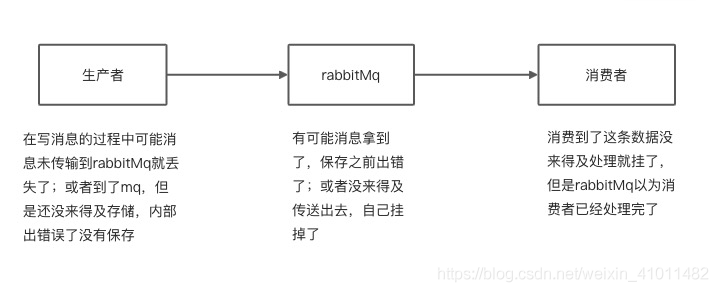
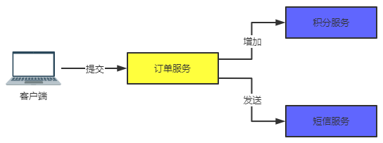
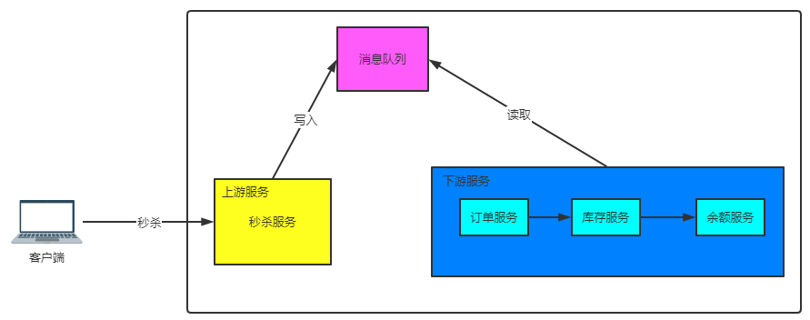

## 什么叫消息队列？

消息（Message）是指在应用间传送的数据。消息可以是  文本字符串  嵌入对象。

消息队列（Message Queue）是一种应用间的通信方式，消息发送后可以立即返回，由消息系统来确保消息的可靠传递。

消息发布者只管把消息发布到 MQ 中而不用管谁来取，消息使用者只管从 MQ 中取消息而不管是谁发布的。这样发布者和使用者都不用知道对方的存在。

为什么要用消息队列？

主要原因是由于在高并发环境下，由于来不及同步处理，请求往往会发生堵塞，比如说，大量的insert，update之类的请求同时到达MySQL，直接导致无数的行锁表锁，甚至最后请求会堆积过多，从而触发too many connections错误。通过使用消息队列，我们可以异步处理请求，从而缓解系统的压力。

RabbitMQ的特点

可靠性（Reliability）

RabbitMQ 使用一些机制来保证可靠性，如持久化、传输确认、发布确认。

灵活的路由（Flexible Routing）

在消息进入队列之前，通过 Exchange 来路由消息的。对于典型的路由功能，RabbitMQ 已经提供了一些内置的 Exchange 来实现。针对更复杂的路由功能，可以将多个 Exchange 绑定在一起，也通过插件机制实现自己的 Exchange 。

消息集群（Clustering）

多个 RabbitMQ 服务器可以组成一个集群，形成一个逻辑 Broker 。

高可用（Highly Available Queues）

队列可以在集群中的机器上进行镜像，使得在部分节点出问题的情况下队列仍然可用。

多种协议（Multi-protocol）

RabbitMQ 支持多种消息队列协议，比如 STOMP、MQTT 等等。

多语言客户端（Many Clients）

RabbitMQ 几乎支持所有常用语言，比如 Java、.NET、Ruby 等等。

管理界面（Management UI）

RabbitMQ 提供了一个易用的用户界面，使得用户可以监控和管理消息 Broker 的许多方面。

跟踪机制（Tracing）

如果消息异常，RabbitMQ 提供了消息跟踪机制，使用者可以找出发生了什么。

插件机制（Plugin System）

RabbitMQ 提供了许多插件，来从多方面进行扩展，也可以编写自己的插件。

## 六大模式

##### simple简单模式(点对点)

  

1. 消息产生着§将消息放入队列
2. 消息的消费者(consumer) 	监听(while) 	消息队列,如果队列中有消息,就消费掉,消息被拿走后,自动从队列中删除(隐患 	消息可能没有被消费者正确处理,已经从队列中消失了,造成消息的丢失)应用场景:聊天(中间有一个过度的服务器;p端,c端)

#####   work工作模式(资源的竞争)

  

1. 消息产生者将消息放入队列消费者可以有多个,消费者1,消费者2,同时监听同一个队列,消息被消费?C1 	C2共同争抢当前的消息队列内容,谁先拿到谁负责消费消息(隐患,高并发情况下,默认会产生某一个消息被多个消费者共同使用,可以设置一个开关(syncronize,与同步锁的性能不一样) 	保证一条消息只能被一个消费者使用)
2. 应用场景:红包;大项目中的资源调度(任务分配系统不需知道哪一个任务执行系统在空闲,直接将任务扔到消息队列中,空闲的系统自动争抢)

#####  publish/subscribe发布订阅(共享资源)

  

1. X代表交换机rabbitMQ内部组件,erlang 	消息产生者是代码完成,代码的执行效率不高,消息产生者将消息放入交换机,交换机发布订阅把消息发送到所有消息队列中,对应消息队列的消费者拿到消息进行消费
2. 相关场景:邮件群发,群聊天,广播(广告)

#####  routing路由模式

  

1. 消息生产者将消息发送给交换机按照路由判断,路由是字符串(info) 	当前产生的消息携带路由字符(对象的方法),交换机根据路由的key,只能匹配上路由key对应的消息队列,对应的消费者才能消费消息;
2.  	根据业务功能定义路由字符串
3. 从系统的代码逻辑中获取对应的功能字符串,将消息任务扔到对应的队列中业务场景:error 	通知;EXCEPTION;错误通知的功能;传统意义的错误通知;客户通知;利用key路由,可以将程序中的错误封装成消息传入到消息队列中,开发者可以自定义消费者,实时接收错误;

##### topic 主题模式(路由模式的一种)

  

1.  	星号井号代表通配符
2. 星号代表多个单词,井号代表一个单词
3.  	路由功能添加模糊匹配
4. 消息产生者产生消息,把消息交给交换机
5. 交换机根据key的规则模糊匹配到对应的队列,由队列的监听消费者接收消息消费

#####  RPC 模式

​	1.对于RPC请求，客户端发送一条带有两个属性的消息:replyTo,设置为仅为请求创建的匿名独占队	列,和correlationId,设置为每个请求的惟一id值。

 	2.请求被发送到rpc_queue队列。

 	3.RPC工作进程(即:服务器)在队列上等待请求。当一个请求出现时，它执行任务,并使用replyTo字	段中的队列将结果发回客户机。

 	4.客户机在回应消息队列上等待数据。当消息出现时，它检查correlationId属性。如果匹配请求中	的值，则向程序返回该响应数据。

## RabbitMQ的基本概念

### AMQP协议

AMQP协议：AMQP,即Advanced Message Queuing Protocol(高级消息队列协议)，是一个网络协议，是应用层协议的一个开放标准，为面向消息的中间件设计。基于此协议的客户端与消息中间件可传递消息，并不受客户端/中间件不同产品，不同的开发语言等条件的限制。2006年，AMQP规范发布。类比HTTP。

### RabbitMQ

2007年，Rabbit技术公司基于AMQP标准开发的RabbitMQ1.0发布。RabbitMQ采用Erlang语言开发。Erlang语言由Ericson设计，专门为开发高并发和分布式系统的一种语言，在电信领域使用广泛。

Broker:接收和分发消息的应用，RabbitMQ Server就是Message Broker
Virtual host:出于多租宁和安全因素设计的，把AMQP的基本组件划分到一个虚拟的分组中，类似于网络中的namespace概念。当多个不同的用户使用同一个RabbitMQ server提供的服务时，可以划分出多个vhost,每个用户在自己的vhost创建exchange/queue等
Connection:publisher/consumer和broker之间的TCP连接
Channel:如果每一次访问RabbitMQ都建立一个Connection,在消息量大的时候建立TCP Connection的开销将是巨大的，效率也较低。Channel是在connection内部建立的逻辑连接，如果应用程序支持多线程，通常每个thread创建单独的channel进行通讯，AMQP method包含了channel id帮助客户端和message broker识别channel,所以channel之间是完全隔离的。Channel作为轻量级的Connection极大减少了操作系统建立TCP connection的开销
Exchange:message到达broker的第一站，根据分发规则，匹配查询表中的routing key,分发消息到queue中去。常用的类里型有：direct(ooint-to-point),topic(publish-subscribe)and fanout(multicast)
Queue:消息最终被送到这里等待consumer取走
Binding:exchange和queue之间的虚拟连接，binding中可以包含routing key。.Binding信息被保存到exchange中的查询表中，用于message的分发依据
生产模式
RabbitMQ提供了6种工作模式：简单模式、work queues、Publish,/Subscribe发布与订阅模式、Routing路由模式、Topics主题模式、RPC远程调用模式（远程调用，不太算MQ;暂不作介绍）。

### JMS

JMS即Java消息服务(JavaMessage Service)应用程序接口，是一个Java平台中关于面向消息中间件的API
JMS是JavaEE规范中的一种，类比JDBC
很多消息中间件都实现了JMS规范，例如：ActiveMQ。RabbitMQ官方没有提供JMS的实现包，但是开源社区有

## 常见的MQ产品

## MQ的使用场景

生产者不需要从消费者处获得及馈。引入消息队列之前的直接调用，其接口的返回值应该为空，这才让明
明下层的动作还没做，上层却当成动作做完了继续往后走，即所谓异步成为了可能。
容许短暂的不一致性。
确实是用了有效果。即解耦、提速、削峰这些方面的收益，超过加入MQ,
管理MQ这些成本。

## Rabbitmq高可用搭建

##### 为什么使用集群？

内建集群作为RabbitMQ最优秀的功能之一，它的作用有两个：

允许消费者和生产者在Rabbit节点崩溃的情况下继续运行；

通过增加节点来扩展Rabbit处理更多的消息，承载更多的业务量；

##### 集群的特点

RabbitMQ的集群是由多个节点组成的，但我们发现不是每个节点都有所有队列的完全拷贝。

RabbitMQ节点不完全拷贝特性

##### 为什么默认情况下RabbitMQ不将所有队列内容和状态复制到所有节点？

有两个原因：

存储空间——如果每个节点都拥有所有队列的完全拷贝，这样新增节点不但没有新增存储空间，反而增加了更多的冗余数据。

性能——如果消息的发布需安全拷贝到每一个集群节点，那么新增节点对网络和磁盘负载都会有增加，这样违背了建立集群的初衷，新增节点并没有提升处理消息的能力，最多是保持和单节点相同的性能甚至是更糟。

所以其他非所有者节点只知道队列的元数据，和指向该队列节点的指针。

##### 集群异常处理

根据节点不无安全拷贝的特性，当集群节点崩溃时，该节点队列和关联的绑定就都丢失了，附加在该队列的消费者丢失了其订阅的信息，那么怎么处理这个问题呢？

这个问题要分为两种情况：

消息已经进行了持久化，那么当节点恢复，消息也恢复了；

消息未持久化，可以使用下文要介绍的双活冗余队列，镜像队列保证消息的可靠性；

##### 集群节点类型

节点的存储类型分为两种：

磁盘节点

内存节点

磁盘节点就是配置信息和元信息存储在磁盘上，内次节点把这些信息存储在内存中，当然内次节点的性能是大大超越磁盘节点的。

单节点系统必须是磁盘节点，否则每次你重启RabbitMQ之后所有的系统配置信息都会丢失。

RabbitMQ要求集群中至少有一个磁盘节点，当节点加入和离开集群时，必须通知磁盘节点。

特殊异常：集群中唯一的磁盘节点崩溃了

如果集群中的唯一一个磁盘节点，结果这个磁盘节点还崩溃了，那会发生什么情况？

如果唯一磁盘的磁盘节点崩溃了，不能进行如下操作：

不能创建队列

不能创建交换器

不能创建绑定

不能添加用户

不能更改权限

不能添加和删除集群几点

总结：如果唯一磁盘的磁盘节点崩溃，集群是可以保持运行的，但你不能更改任何东西。

解决方案：在集群中设置两个磁盘节点，只要一个可以，你就能正常操作。

##### 集群搭建方法

步骤一：安装多个RabbitMQ

步骤二：加入RabbitMQ节点到集群

 	设置三个节点

## 服务集群

实例名称一样未来就是集群

实例名称替换端口号使用 可以实现在任意机器上调用

## mq如何保证消息的顺序性:

 1.消息顺序进入，拆分多个queue，每个queue一个consumer，就是多一些queue而已，确实是麻烦点；这样也会造成吞吐量下降，可以在消费者内部采用存入队列排队的方式取消费。  

 2.一个queue对应一个consumer，然后这个consumer内部用内存队列做排队，然后分发给底层不同的worker来处理  

## mq 如何削峰的?

使用了MQ之后，限制消费消息的速度为1000，这样一来，高峰期产生的数据势必会被积压在MQ中，高峰就被“削”掉了，但是因为消息积压，在高峰期过后的一段时间内，消费消息的速度还是会维持在1000，直到消费完积压的消息，这就叫做“填谷”。

mq 中间通过一个队列在一端承接瞬时的流量洪峰，在另一端平滑地将消息推送出去。
采取mq的拉模式,然后设置每一千条消息消费一次,或者多长时间消费一次
通过basicQos的方法控制读取的消息数量的上限,签收改为手动签收
RabbitMQ 推送消息给 Consumer 时，会附带一个 Delivery Tag，
以便 Consumer 可以在消息确认时告诉 RabbitMQ 到底是哪条消息被确认了。

## mq异步和扣库存如何提升效率?

指定mq消费者每次只拉取消费1000条消息消费,然后1000条数据进行批量添加,一千条数据库的订单添加只访问一次数据库,这样也可以提升效率

## mq有哪些消费模式

- 推模式
  注册一个消费者后，RabbitMQ会在消息可用时，自动将消息进行推送给消费者。这种方式效率最高最及时。
- 拉模式
  属于一种轮询模型，发送一次get请求，获得一个消息。如果此时RabbitMQ中没有消息，会获得一个表示空的回复。
- 自动确认

消费者消费消息的时候，将自动向RabbitMQ进行确认。

- 手动确认

消费者消费消息的时候，手动调用相应函数进行ack 应答

- qos预取模式

在确认消息被接收之前，消费者可以预先要求接收一定数量的消息，在处理完一定数量的消息后，批量进行确认

当然，如果消费者应用程序在确认消息之前崩溃，则所有未确认的消息将被重新发送给其他消费者

### mq的pull（拉）和push（推）模式

推模式
 ​简介​

 本处推模式指的是消息从 Broker（代理人） 推向 Consumer，即 Consumer 被动的接收消息，由 Broker 来主导消息的发送。

 ​优点​

 ​消息实时性高。​Broker 接受完消息之后可以立马推送给 Consumer。
 ​对于消费者使用来说更简单。​消息来了就消费即可。
 ​缺点​

 ​推送速率难以适应消费速率​

 推模式的目标就是以最快的速度推送消息，当生产者往 Broker 发送消息的速率大于消费者消费消息的速率时，随着时间的增长消费者那边可能就“爆仓”了
 不同的消费者的消费速率还不一样，身为 Broker 很难平衡每个消费者的推送速率，如果要实现自适应的推送速率那就需要在推送的时候消费者告诉 Broker ，然后 Broker 需要维护每个消费者的状态进行推送速率的变更。

 ​使用场景​

 推模式难以根据消费者的状态控制推送速率，适用于消息量不大、消费能力强要求实时性高的情况下。 

 拉模式
 ​简介​

 本处拉模式指的是 Consumer 主动向 Broker 请求拉取消息，即 Broker 被动的发送消息给 Consumer。

 ​优点​

 ​消费者可以根据自身的情况来发起拉取消息的请求​。假设当前消费者觉得自己消费不过来了，它可以根据一定的策略停止拉取，或者间隔拉取都行。
 ​Broker 相对轻松了。​它只管存生产者发来的消息，至于消费的时候自然由消费者主动发起，来一个请求就给它消息呗，从哪开始拿消息，拿多少消费者都告诉它
 ​可以更合适的进行消息的批量发送​，基于推模式可以来一个消息就推送，也可以缓存一些消息之后再推送，但是推送的时候其实不知道消费者到底能不能一次性处理这么多消息。而拉模式就更加合理，它可以参考消费者请求的信息来决定缓存多少消息之后批量发送。

 ​缺点​

 ​消息延迟​，毕竟是消费者去拉取消息，但是消费者怎么知道消息到了呢？所以它只能不断地拉取，但是又不能很频繁地请求，太频繁了就变成消费者在攻击 Broker 了。因此需要降低请求的频率，比如隔个 2 秒请求一次，你看着消息就很有可能延迟 2 秒了。
 ​消息忙请求​，忙请求就是比如消息隔了几个小时才有，那么在几个小时之内消费者的请求都是无效的，在做无用功。

### Long-Polling

使用long-polling模式，Consumer主动发起请求到Broker，正常情况下Broker响应消息给Consumer；在没有消息或者其他一些特殊场景下，可以将请求阻塞在服务端延迟返回。

long-polling不是一种Push模式，而是Pull的一个变种。

那么：

- 在Broker一直有可读消息的情况下，long-polling就等价于执行间隔为0的pull模式（每次收到Pull结果就发起下一次Pull请求）。 	 	
- 在Broker没有可读消息的情况下，请求阻塞在了Broker，在产生下一条消息或者请求“超时之前”响应请求给Consumer。 	 	

以上两点避免了多余的Pull请求，同时也解决Pull请求的执行频率导致的“额外”的延迟。

注意上面有一个概念：“超时之前”。每一个请求都有超时时间，Pull请求也是。“超时之前”的含义是在Consumer的“Pull”请求超时之前。

基于long-polling的模型，Broker需要保证在请求超时之前返回一个结果给Consumer，无论这个结果是读取到了消息或者没有可读消息。

因为Consumer和Broker之间的时间是有偏差的，且请求从Consumer发送到Broker也是需要时间的，所以如果一个请求的超时时间是5秒，而这个请求在Broker端阻塞了5秒才返回，那么Consumer在收到Broker响应之前就会判定请求超时。所以Broker需要保证在Consumer判定请求超时之前返回一个结果。

 通常的做法时在Broker端可以阻塞请求的时间总是小于long-polling请求的超时时间。比如long-polling请求的超时时间为30秒，那么Broker在收到请求后最迟在25s之后一定会返回一个结果。中间5s的差值来应对Broker和Consumer的始终存在偏差和网络存在延迟的情况。 （可见Long-Polling模式的前提是Broker和Consumer之间的时间偏差没有“很大”）

## `RabbitMQ` 的作用

- 削峰填谷
- 生产者和消费者业务解耦
- 服务间异步通信
- 定时任务
- 顺序消费

## `RabbitMQ` 消息积压问题

### 产生原因有可能是

消费端宕机
消费端消费能力不足
生产端发送流量过大

### 解决方案

​    方案一：通常的解决方案就是增加消费端实例。说白了就是增加机器。如果出现线上事故，能申请多少机器就申请多少机器，争取在最短的时间内消费掉积压在MQ中的消息。

​    方案二：如果申请机器行不通，毕竟公司的机器是有限的，此时可以增加消费端的消费能力。在MQ的配置中配置"最大消费者数量"与"每次从队列中获取的消息数量"

​    方案三：如果还是不能解决问题的话，还有另外一种解决方案。紧急上线专门用于记录消息的队列，不多BB，先把MQ中的消息记录到数据库中，然后再慢慢的消化处理。

方案一实际案例:

1.先定位消费者出现了什么错误,解决消费端错误之后停掉消费者临时建立好原先十倍左右的queue 	 	
2.写一个临时分发消息的consumer 	
3.将原先队列中的数据分发给临时建立的这十个队列中做轮询处理征用十倍的机器来部署consumer 	
4.每个consumer消费一个queue,这种方法相当于以十倍的速度来处理消息 	
5.当消息降低到一定程度的时候恢复原来的架构

## rabbitmq消息的持久化

RabbitMQ 持久化包含3个部分

- exchange 	持久化，在声明时指定 	durable 	为 	true 	 	
- queue 	持久化，在声明时指定 	durable 	为 	true 	 	
- message 	持久化，在投递时指定 	delivery_mode=2（1是非持久化）

## 消息丢失的三种情况怎么防止

 

1、生产者丢失数据

开启rabbitmq的confirm模式，把rabbitmq的channel(通道)设置为confirm模式。那么发送完消息之后，rabbitmq接收到了消息会回调生产者的一个接口，告知接收成功；如果接收失败会告诉生产者接收失败了，你需要重发。

2、rabbitmq消息丢失

这个就需求开启rabbitmq的持久化，将接收到消息后将数据持久化到磁盘中，这样哪怕rabbitmq自己挂掉了，重启之后也能在磁盘中获取到之前的数据。除非是接收到消息还没存入磁盘就挂掉了，这基本是很小的概率。

持久化有两个步骤，

一个是创建queue的时候将其持久化，这样可以保证持久化queue的元数据，但是不会持久化queue里面的数据。

另一个是发送消息的时候将deliveMode设置为2，意思是将消息设置为持久化，这样一来就rabbitmq就会保证数据不丢失

这个持久化可以和上面生产者中的confirm模式结合起来，只有rabbitmq将消息持久化到磁盘之后，在通知生产者接收消息成功了，这样哪怕持久化之前mq挂了，也不怕消息丢失，因为生产者可以重发。

3、消费者消息丢失

这种消息丢失的情况呢，一般就是因为消费者开启了autoAck机制，是一种向rabbitmq自动回复处理完消息的通知机制。会出现消费者本身还未处理完，但是autoAck提前发送了，后面又突然宕机，就会导致这条消息丢失掉。

这种情况就是不要使用自动的autoAck，把这个功能关掉。自己来处理消息，保证消息处理完成之后再手动调用rabbitmq的ack接口来通知它我们已经处理完这条消息了，如果rabbitmq长时间未接受到成功的回执那么就会将消息分发给其他的消费者。

RabbitMQ这个中间件默认的一个行为，就是只要仓储服务收到一个订单消息，RabbitMQ就会立马把这条订单消息给标记为删除，这个行为叫做自动ack，也就是投递完成一条消息就自动确认这个消息处理完毕了。  

 一行关键的代码：

  

 这行代码对channel.basicConsume()方法，传入的第二个参数：true，其实就是一个关键的参数。

这个true就代表了一个核心的含义，他的意思是，RabbitMQ只要把一个消息投递到仓储服务手上，立马就标记这个消息删除了。  

突然宕机导致一条订单消息丢失，就需要改造一下仓储服务消费消息的代码了。

首先，我们需要把那个参数从true改为false，如下代码所示：

  

 只要修改为false之后，RabbitMQ就不会盲目的投递消息到仓储服务，立马就删除消息了，说白了就是关闭autoAck的行为，不要自作主张的认为消息处理成功了。

 接着，我们需要改造一下处理订单消息的代码，如下代码所示。

 这段代码，说白了，就是在对订单完成了调度发货之后，在finally代码块中手动执行了ack操作，说我自己已经完成了耗时几十秒的业务逻辑的处理，现在可以手动ack通知RabbitMQ，这个消息处理完毕了。

 

 

 此时整个架构运行流程大致看起来跟下面的图那样子。

  

 架构流程改成上面那样后，就意味着只有完成了仓储调度发货的代码业务逻辑，确保仓库系统收到通知之后，仓储服务才会在代码中手动发送ack消息给RabbitMQ。

总结一下rabbitMq保证数据不丢失就是，生产者开启confirm模式保证数据被rabbitmq接收，rabbitmq本身开启磁盘持久化，消费者将自动的autoAck机制关闭改为处理完消息后手动提交ack

## 如何避免消息重复消费

>  幂等性也就是相同条件下对一个业务的操作，不管操作多少次，结果都是一样。

##  重复消费的问题？

 导致重复消费的原因可能出现在生产者，也可能出现在 MQ 或 消费者。

 这里说的重复消费问题是指同一个数据被执行了两次，不单单指 MQ 中一条消息被消费了两次，也可能是 MQ 中存在两条一模一样的消费。

-  生产者：生产者可能会重复推送一条数据到 MQ 中，为什么会出现这种情况呢？也许是一个 Controller 	接口被重复调用了 2 次，没有做接口幂等性导致的；也可能是推送消息到 MQ 时响应比较慢，生产者的重试机制导致再次推送了一次消息。
-  MQ：在消费者消费完一条数据响应 ack 信号消费成功时，MQ 突然挂了，导致 MQ 以为消费者还未消费该条数据，MQ 恢复后再次推送了该条消息，导致了重复消费。
-  消费者：消费者已经消费完了一条消息，正准备但是还未给 MQ 发送 ack 信号时，此时消费者挂了，服务重启后 MQ 以为消费者还没有消费该消息，再次推送了该条消息。

##  如何保证幂等性？

 消费者怎么解决重复消费问题呢？这里提供两种方法：

-  状态判断法：消费者消费数据后把消费数据记录在 redis 中，下次消费时先到 redis 中查看是否存在该消息，存在则表示消息已经消费过，直接丢弃消息。
-  业务判断法：通常数据消费后都需要插入到数据库中，使用数据库的唯一性约束防止重复消费。每次消费直接尝试插入数据，如果提示唯一性字段重复，则直接丢失消息。一般都是通过这个业务判断的方法就可以简单高效地避免消息的重复处理了。

## 消息队列使用场景，说出两个

1.分布式场景

1.1、异步处理

一般我们写的程序都是按照顺序执行的（即同步的方式）。比如电商系统中订单的例子，其执行顺序如下：

1. 用户提交订单。
2. 订单完成以后增加积分。
3. 发生积分变动的短信通知。

可以用下面的流程图表示：

 

如果按照上面的顺序执行，假如每个服务都需要花费一秒，那么客户端就要花费3秒的时间。对于用户来说，3秒的时间显然是不能忍受的，那么我们该如何解决呢？我们可以使用异步的方式来解决这个问题，看下面一张流程图：

 

 按照这种方式，积分服务和短信服务使用线程异步的方式进行操作，那么客户端只需要花费1秒的时间就可以完成了。但是，这种异步的方式会带来另外的问题：并发量降低。因为积分服务和短信服务都需要在订单服务里面开启线程，开启的线程多了，会导致客户端访问订单服务的并发量降低，可能导致客户端提交订单的实际时间会超过1秒钟。那么如何解决异步带来的问题呢？那就是使用消息队列，看下面的流程图：

 

在上面的流程中，我们增加了一个消息队列的角色，首先由客户端提交订单，然后把订单写入到消息队列，积分服务和短信服务同时去消费消息队列里面的消息，这种方式不需要订单服务在额外的开启异步线程，客户端可以实现真正的耗时1秒。

1.2、应用解耦

 我们还是以电商系统为例进行讲解，先看下面的流程图：

 

上图的业务逻辑：客户端发起一个创建订单的请求，创建订单的时候，我们要先获取库存，然后在去扣减库存，这样订单系统和库存系统就形成了非常紧密的依赖关系。假如这时候库存系统发生了宕机，由于订单系统依赖于库存系统，这时候订单系统将不能使用。那么如何解决呢？

看下面使用消息队列的流程图：

 

在上面的流程中，我们加入了消息队列。首先客户端发起创建订单的请求，订单的消息写入到消息队列里面，然后库存系统去消息队列里面订阅消息，最后异步的去更新库存系统。如果库存系统发生了宕机，由于订单系统不直接依赖于库存系统，所以订单系统可以正常的响应客户端的请求。这样就实现了应用解耦。

1.3、流量削峰

对于高并发的系统来说，在访问高峰时，突发的流量就像洪水般涌向应用系统，尤其是一些高并发写操作，随时会导致数据库服务器瘫痪，无法继续提供服务。

而引入消息队列则可以减少突发流量对应用系统的冲击。消费队列就像“水库”一样，拦截上游的洪水，削减进入下游河道的洪峰流量，从而达到减免洪水灾害的目的。

在这方面最常见的例子就是秒杀系统，一般秒杀活动瞬间流量很高，如果流量全部涌向秒杀系统，会压垮秒杀系统，通过引入消息队列，可以有效缓冲突发流量，达到“削峰”的作用。

我们使用秒杀的场景来描述流量削峰，先看下面一张流程图：

 

在上面的流程中，我们把秒杀服务称为上游服务，订单服务、库存服务、余额服务统称为下游服务。客户端发起秒杀的请求，秒杀服务收到客户端发送的请求以后，创建订单，修改库存，扣减余额，这是秒杀的基本业务场景。

假如下游服务只能同时处理1000个并发请求，上游服务可以处理10000个并发请求，而客户端发起了10000个请求，超出了下游服务可以处理的并发量，所以会导致下游服务发生宕机。这时就可以加入消息队列来解决宕机的问题。看下面加入消息队列的流程图：

 

我们在上面的流程图中加入了消息队列，描述服务接收到客户端发送的10000个请求以后，把所有的请求都写入到消息队列中，然后下游服务去订阅消息队列里面的秒杀请求，然后在去执行自己的业务逻辑操作。

我们举个简单的例子，上游服务还是能处理10000个并发请求，下游服务还是只能处理1000个并发请求，那么这时候我们在消息队列里面会允许存1000个并发请求。上游的秒杀服务接收到10000个并发请求，而消息队列里面只能存1000个请求，多余的请求就不会存入到消息队列里面，直接返回给客户端提示“系统繁忙，请稍后！”。这就是所谓的流量削峰场景。这是由下游服务可以处理的并发量决定的。由于下游服务只能处理1000个并发请求，所以消息队列里面只能存1000个秒杀，多余的秒杀请求全部返回客户端提示。这样就保证了下游服务的正常响应，不会导致下游服务发生宕机，提高了系统的可用性。

2、日志场景

2.1、优化日志传输

为了程序的健壮性，我们一般会在程序中添加各种记录日志的功能，比如错误日志、操作日志等等，看下面一张流程图：

 

上面的流程图是同步记录日志的流程。使用同步记录日志的流程，会使得整个流程花费的时间增多，而且也会容易造成业务系统宕机（如果数据库损坏了，向数据库记录日志的操作将会产生错误）。我们可以使用消息队列的方式优化日志的传输。看下面的流程图：

 

加入了消息队列以后，可以缩短系统花费的时间，而且也可以达到应用系统解耦的功能 。

3、及时通讯场景

3.1、聊天室

 消息队列最主要功能是收发消息，其内部有高效的通讯机制，因此非常适合用于消息通讯。

我们可以基于消息队列开发点对点的聊天系统，也可以开发广播系统，用于将消息广播给大量接收者。

 

## 消息签收

rabbitMQ有个 ack 签收机制，简单来说就是三种模式：

AcknowledgeMode.NONE：默认推送的所有消息都已经消费成功，会不断地向消费端推送消息。所以推送出去的消息不会暂存在server端

AcknowledgeMode.AUTO： 由 spring-rabbit 依据消息处理逻辑是否抛出异常自动发送 ack（无异常）或 nack（异常）到 server 端。

AcknowledgeMode.MANUAL：模式需要人为地获取到 channel 之后调用方法向 server 发送 ack （或消费失败时的 nack ）信息

总结就是：无 ack 模式：效率高，存在丢失大量消息的风险。有 ack 模式：效率低，不会丢消息。

## 什么是耦合？

 耦合，是架构中，本来不相干的代码、模块、服务、系统因为某些原因联系在一起，各自独立性差，影响则相互影响，变动则相互变动的一种架构状态。

 解耦：在项目启动之初是很难预测未来会遇到什么困难的，消息中间件在处理过程中插入了一个隐含的，基于数据的接口层，两边都实现这个接口，这样就允许独立的修改或者扩展两边的处理过程，只要两边遵守相同的接口约束即可。

 一个对象，往往需要跟其他对象打交道，既包括获知其他对象的状态，也包括仰赖其他对象的行为，而一旦这样的事情发生时，我们便称该对象依赖于另一对象。只要两个对象之间存在一方依赖一方的关系，那么我们就称这两个对象之间存在耦合。

二者互相依赖，因此也存在耦合。首先要说，耦合是必要的

解耦和最重要的原则就是依赖倒置原则：

解耦核心思想是【彼此独立，互不依赖】

高层模块不应该依赖底层模块，他们都应该依赖抽象。抽象不应该依赖于细节，细节应该依赖于抽象。

## 什么是延迟队列，有什么特点，使用场景

延迟队列:

延迟队列存储的是对应的延时消息，所谓”延时消息”是指当消息被发送以后，并不想让消费者立即拿到消息，而是等待指定时间后，消费者才拿到这个消息进行消费。

特点

其延时的属性上，普通队列的元素是先进先出，按入队顺序进行处理，而延时队列中的元素在入队时会指定一个延迟时间，表示其希望能够在经过该指定时间后处理。

使用场景:

订单超时关闭：在支付场景中，一般上订单在创建后30分钟或1小时内未支付的，会自动取消订单。

短信或者邮件通知：在一些注册或者下单业务时，需要在1分钟或者特定时间后进行短信或者邮件发送相关资料的。本身此类业务于主业务是无关联性的，一般上的做法是进行异步发送。

重试场景：比如消息通知，在第一次通知出现异常时，会在隔几分钟之后进行再次重试发送。

## rabbbitMq和rocketMq的区别

 1.rabbitMq消息延迟是毫秒级 rocketMq的消息延迟是微妙级 2. rabbitMq的可用性比rocketMq高  3. rockerMq理论上消息不丢失 rabbitMq不能保证

 activeMq

 适合tps较少的情况

 数据量越大，查找和消费消息就越慢，消息积压程度与消息速度成反比。

 `缺点`  

1.`吞吐量低`。由于 ActiveMQ 需要建立索引，导致吞吐量下降。这是无法克服的缺点，只要使用完全符合 JMS 规范的消息中间件，就要接受这个级别的TPS。
 2.`无分片功能`。这是一个功能缺失，JMS 并没有规定消息中间件的集群、分片机制。而由于 ActiveMQ 是伟企业级开发设计的消息中间件，初衷并不是为了处理海量消息和高并发请求。如果一台服务器不能承受更多消息，则需要横向拆分。ActiveMQ 官方不提供分片机制，需要自己实现。

## rabbitmq怎么查看消息轨迹

### [RabbitMq](https://so.csdn.net/so/search?q=RabbitMq&spm=1001.2101.3001.7020)之Tracing插件（消息轨迹追踪）

开启 Tracing 插件命令  

rabbitmq-plugins enable rabbitmq_tracing  

配置Add a new trace  设置Format：日志文件格式（TEXT/JSON） 配置用户名 密码

All traces中会有对应记录，在Trace log files中点击对应名字的日志文件 trace.test.log

 可以看到消息纪律轨迹

